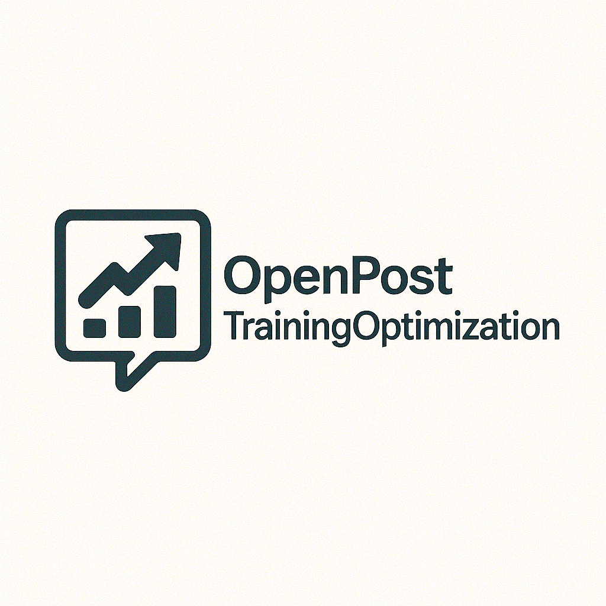

<p align="center">
  
</p>

# OpenPostTrainingOptimizations

Portable post-training optimization toolkit for large language models with comprehensive AI agents integration. Runs locally on Apple Silicon (MLX/MPS/CPU) and Linux/CUDA platforms.

**Author:** Nik Jois

## Features

- **Multi-Backend Support**: MLX (Apple Silicon), MPS, CUDA, CPU
- **Quantization**: INT8, INT4, GPTQ, AWQ methods
- **Sparsity Optimization**: Unstructured and N:M structured sparsity
- **Speculative Decoding**: Draft-verify architecture for faster generation
- **Performance Profiling**: Latency, throughput, memory analysis
- **Model Serving**: MLX, llama.cpp, and vLLM backends
- **AI Agents Integration**: OpenAI Agents SDK with tool calling
- **Ollama Integration**: Local model management and inference
- **LLM Toolkit**: Simon Willison's llm CLI integration
- **Data Management**: Datasette and sqlite-utils for metrics and artifacts
- **Terminal UI**: Intuitive TUI for interactive workflows
- **CLI**: Comprehensive command-line interface
- **Docker Support**: Multi-stage builds with docker-compose stack

## Quick Start

### Installation

#### Using uv (Recommended)

```bash
# Install uv
pip install uv

# Install with all features
uv pip install -e ".[dev,serve,agents,data]"

# Apple Silicon only
uv pip install -e ".[apple,serve,agents,data]"

# CUDA only
uv pip install -e ".[cuda,serve,agents,data]"
```

#### Using pip

```bash
# Install base package
pip install -e .

# Install with extras
pip install -e ".[apple,serve,agents,data,dev]"
```

#### Using virtualenv

```bash
python -m venv .venv
source .venv/bin/activate
pip install -e ".[dev,serve,agents,data]"
```

#### Using hatch

```bash
hatch env create
hatch shell
```

### Basic Usage

#### CLI Examples

```bash
# Device status
opt status --device auto

# Quantization
opt quantize -m gpt2 --method int8 -o outputs/gpt2-int8 --device mps
opt quantize -m mlx-community/TinyLlama-1.1B-Chat-v1.0 --method int4 -o outputs/tinyllama-q4 --device mlx

# Sparsity
opt sparsify -m gpt2 -s 0.5 --pattern 2:4 --device mps -o outputs/gpt2-sparse

# Profiling
opt profile -m gpt2 --profile latency throughput memory -e outputs/profile.json --device mps

# Speculative decoding
opt speculative -m gpt2 -d distilgpt2 --gamma 4 --benchmark --device mps -o outputs/spec

# Serving
opt serve -m mlx-community/TinyLlama-1.1B-Chat-v1.0 --backend mlx --port 8000
opt serve -m model.gguf --backend llama_cpp --port 8001
```

#### Terminal UI

```bash
# Launch interactive TUI
opt-tui
```

#### AI Agents Integration

```python
from openposttraining.agents import create_agent, AgentConfig

# Create agent with OpenAI
config = AgentConfig.from_env()
agent = create_agent(config)

# Chat with tool calling
response = agent.chat("Quantize gpt2 to INT8")
print(response)

# Streaming chat
async for chunk in agent.stream_chat("Profile gpt2 performance"):
    print(chunk, end="", flush=True)
```

#### Ollama Integration

```python
from openposttraining.integrations import OllamaIntegration

ollama = OllamaIntegration()

# List models
models = ollama.list_models()

# Pull model
ollama.pull_model("llama3")

# Generate
response = ollama.generate("llama3", "Hello, world!")

# Chat
messages = [{"role": "user", "content": "Hello"}]
response = ollama.chat("llama3", messages)

# Embeddings
embeddings = ollama.embeddings("llama3", "text to embed")
```

#### LLM Toolkit

```python
from openposttraining.integrations import LLMToolkitIntegration

llm = LLMToolkitIntegration()

# List models
llm.list_models()

# Generate
response = llm.prompt("Hello", model="ollama:llama3")

# Command generation with llm-cmd
command = llm.run_cmd("list files in current directory")
```

#### Datasette and sqlite-utils

```python
from openposttraining.integrations import DatasetteIntegration

datasette = DatasetteIntegration()

# Insert prompt
datasette.insert_prompt(
    prompt="Quantize model",
    model="gpt-4o",
    response="I'll help quantize your model...",
)

# Insert run
run_id = datasette.insert_run("opt quantize -m gpt2")
datasette.update_run(run_id, status="completed", duration=45.2)

# Insert metrics
datasette.insert_metric(run_id, "latency_ms", 12.5)

# Query data
results = datasette.query("SELECT * FROM runs WHERE status='completed'")

# Export
data = datasette.export_table("metrics", format="json")

# Serve with Datasette
datasette.serve(port=9000)
```

### Configuration

Create `.env` file:

```bash
OPENAI_API_KEY=your-api-key-here
OPENAI_MODEL=gpt-4o
OLLAMA_BASE_URL=http://localhost:11434
OLLAMA_MODEL=llama3
DATASETTE_DB_PATH=data/openposttraining.db
```

## Architecture

### Component Overview

- **Core**: Quantization, sparsity, speculative decoding, profiling
- **Agents**: OpenAI Agents SDK with tool calling and streaming
- **Integrations**: Ollama, LLM toolkit, Datasette
- **TUI**: Terminal user interface with Textual
- **Deployment**: Inference engines and model servers
- **Utils**: Hardware detection, device management

See [docs/architecture/ARCHITECTURE.md](docs/architecture/ARCHITECTURE.md) for detailed architecture documentation.

## Development

### Setup Development Environment

```bash
# Clone repository
git clone https://github.com/nikjois/openposttraining.git
cd openposttraining

# Install with dev dependencies
uv pip install -e ".[dev,serve,agents,data]"

# Install pre-commit hooks
pre-commit install
```

### Running Tests

```bash
# Run all tests
pytest -q

# Run with coverage
pytest --cov=openposttraining --cov-report=term-missing --cov-report=html

# Run with tox (all Python versions)
tox -q -p auto

# Run with hatch
hatch run test
hatch run dev:cov
```

### Code Quality

```bash
# Format code
ruff format src tests
black src tests
isort src tests

# Lint
ruff check src tests

# Type check
mypy src

# Security scan
bandit -r src -ll

# All checks
make all-checks
```

### Using Makefile

```bash
# See all commands
make help

# Install
make install-uv

# Test
make test-cov

# Quality checks
make all-checks

# Docker
make docker
make docker-compose

# Datasette
make datasette-serve

# Ollama
make ollama-pull-llama3
```

## Docker Deployment

### Build and Run

```bash
# Build image
docker build --target runtime -t openposttraining:latest -f docker/Dockerfile .

# Run container
docker run --rm -p 8000:8000 openposttraining:latest opt status

# Development mode
docker build --target development -t openposttraining:dev -f docker/Dockerfile .
docker run --rm -it openposttraining:dev bash
```

### Docker Compose Stack

```bash
# Start all services (app, Ollama, Datasette)
docker compose -f docker/docker-compose.yml up -d

# View logs
docker compose -f docker/docker-compose.yml logs -f

# Stop services
docker compose -f docker/docker-compose.yml down
```

Services:
- **App**: http://localhost:8000
- **Ollama**: http://localhost:11434
- **Datasette**: http://localhost:9000

### SBOM and Security

```bash
# Generate SBOM
docker sbom openposttraining:latest --format spdx-json -o sbom.json

# Scan for vulnerabilities
trivy image openposttraining:latest
```

## CI/CD

The project includes comprehensive GitHub Actions workflows:

- **CI**: Lint, test (matrix: Python 3.10/3.11/3.12, Linux/macOS), security scans
- **Coverage**: Coverage reporting with Codecov integration
- **Release**: PyPI publish and Docker image push on tagged releases
- **Docker**: Multi-platform builds with SBOM generation

## Data Management with Datasette

### Viewing Data

```bash
# Start Datasette server
datasette serve data/openposttraining.db -p 9000 --cors

# Browse at http://localhost:9000
```

### Querying with sqlite-utils

```bash
# List tables
sqlite-utils tables data/openposttraining.db

# Query data
sqlite-utils query data/openposttraining.db "SELECT * FROM runs LIMIT 10"

# Export to JSON
sqlite-utils query data/openposttraining.db "SELECT * FROM metrics" --json-cols > metrics.json
```

## AI Workflows

### OpenAI Agents with Tools

```python
from openposttraining.agents import create_agent

agent = create_agent()

# Agent automatically calls tools
response = agent.chat("List available models")
response = agent.chat("Quantize gpt2 to INT4")
response = agent.chat("Profile gpt2 latency and throughput")
```

### Ollama Workflows

```bash
# Pull and list models
ollama pull llama3
ollama list

# Use with LLM toolkit
llm models
llm -m ollama:llama3 "Hello, how are you?"

# Python integration
python -c "from openposttraining.integrations import OllamaIntegration; o = OllamaIntegration(); print(o.generate('llama3', 'Hello'))"
```

## Feature Matrix

| Feature | CUDA | MPS | MLX | CPU |
|---------|------|-----|-----|-----|
| INT8/INT4 Quantization | bnb/Quanto | Quanto | MLX native | Quanto |
| Flash Attention | flash-attn/Triton | SDPA | SDPA | SDPA |
| vLLM Serving | Yes | No | No | No |
| MLX Serving | No | No | Yes | No |
| llama.cpp Serving | Yes | Yes (CPU) | Yes (Metal) | Yes |
| Sparsity (2:4) | Yes | Yes | Yes | Yes |
| Speculative Decoding | Yes | Yes | Yes | Yes |

## Troubleshooting

### MLX Not Detected
- Ensure you're on Apple Silicon
- Install MLX: `pip install mlx mlx-lm`

### Quanto Not Available
- Install Apple extras: `pip install -e ".[apple]"`

### OpenAI API Key Missing
- Set environment variable: `export OPENAI_API_KEY=your-key`
- Or create `.env` file with key

### Ollama Connection Failed
- Start Ollama: `ollama serve`
- Check URL: `curl http://localhost:11434/api/version`

### Datasette Not Starting
- Install: `pip install datasette sqlite-utils`
- Check database path exists

## Repository Topics

ai, llm, ollama, openai-agents, agents, datasette, sqlite, sqlite-utils, cli, tui, python, uv, tox, hatch, docker, devtools, quantization, optimization, mlx, mps, cuda

## Contributing

We welcome contributions! Please read [CONTRIBUTING.md](CONTRIBUTING.md) for guidelines.

### Quick Contribution Steps

1. Fork the repository
2. Create a feature branch: `git checkout -b feature/your-feature`
3. Make changes and add tests
4. Run quality checks: `make all-checks`
5. Commit: `git commit -m "Add feature"`
6. Push and open a Pull Request

## Code of Conduct

This project adheres to the Contributor Covenant [Code of Conduct](CODE_OF_CONDUCT.md). By participating, you are expected to uphold this code.

## License

Apache License 2.0 - see [LICENSE](LICENSE) for details.

## Changelog

See [CHANGELOG.md](CHANGELOG.md) for version history and release notes.

## Support

- GitHub Issues: https://github.com/nikjois/openposttraining/issues
- Documentation: [docs/](docs/)
- Architecture: [docs/architecture/ARCHITECTURE.md](docs/architecture/ARCHITECTURE.md)

## Author

Nik Jois

## Acknowledgements

Built leveraging:
- PyTorch and Transformers (Hugging Face)
- MLX (Apple)
- OpenAI API and Agents SDK
- Ollama
- Simon Willison's LLM toolkit
- Datasette and sqlite-utils
- Textual (TUI framework)
- FastAPI, uvicorn
- Rich (terminal rendering)

## Version

Current version: **1.1.0**

```python
import openposttraining
print(openposttraining.__version__)
```
